There are two types of graphs:

Undirected graphs

Connected graphs

An **undirected graph** is a graph in which the edges do not point in any direction.

A **connected graph** is a graph in which there is always a path from a vertex to any other vertex.

Spanning tree

A spanning tree is a sub-graph of an undirected connected graph, which includes all the vertices of the graph with a minimum possible number of edges. If a vertex is missed, then it is not a spanning tree.

The total number of spanning trees with n vertices that can be created from a complete graph is equal to n^(n-2).

If we have n=4, the maximum number of possible spanning trees is equal to 4^4-2 = 16. Thus, 16 spanning trees can be formed from a complete graph with 4 vertices.

Ex:-

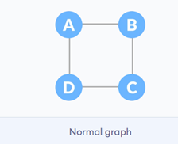    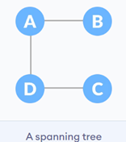   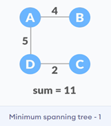

 ref. Programz

Adjacency Matrix

An adjacency matrix is a way of representing a graph as a matrix of booleans (0's and 1's). A finite graph can be represented in the form of a square matrix on a computer, where the boolean value of the matrix indicates if there is a direct path between two vertices.

Ex:-

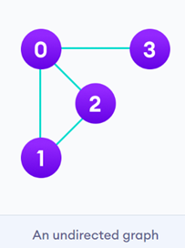   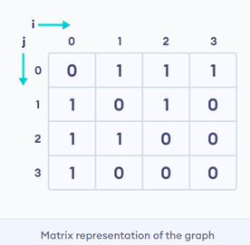

ref. :- Programz

Adjacency List

An adjacency list represents a graph as an array of linked lists. The index of the array represents a vertex and each element in its linked list represents the other vertices that form an edge with the vertex.

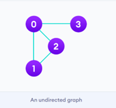  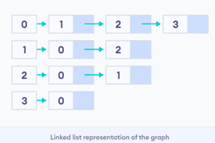

ref. :- Programz

Depth First Search (DFS) (stack)

Depth first Search or Depth first traversal is a recursive algorithm for searching all the vertices of a graph or tree data structure. Traversal means visiting all the nodes of a graph.

A standard DFS implementation puts each vertex of the graph into one of two categories:

Visited

Not Visited

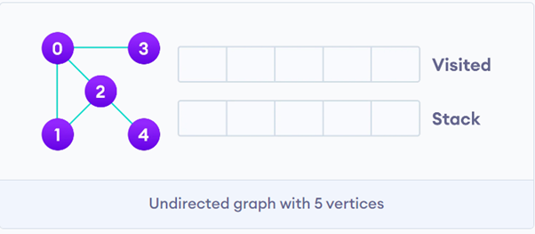

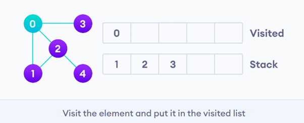

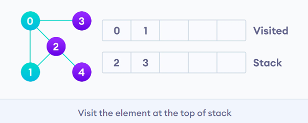

Breadth first search (queue)

Traversal means visiting all the nodes of a graph. Breadth First Traversal or Breadth First Search is a recursive algorithm for searching all the vertices of a graph or tree data structure.

BFS algorithm

A standard BFS implementation puts each vertex of the graph into one of two categories:

Visited

Not Visited

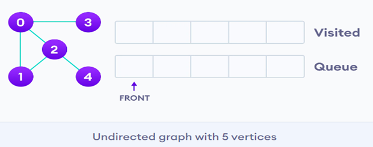

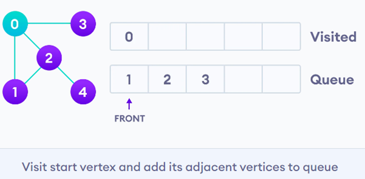

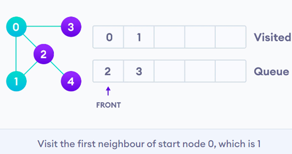

